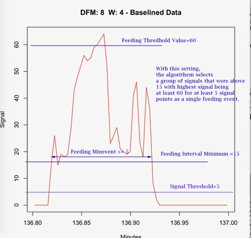

```{r setup, include=FALSE}
knitr::opts_chunk$set(echo = TRUE)
```

## Overview

This document begins a series of markdown files that contain working examples that will hopefully make it easier to understand how we analyze the signal data from FLIC DFMs. We have written many R functions that we find useful for analyzing simple feeding experiments that involve one feeding well per chamber as well as choice experiments that involve two feeding wells per chamber.  These markdown files effectively serve as the documentation for all functions.  The source code is (semi) commented and available from GitHub (https://github.com/PletcherLab/FLIC_R_Code). Example data files are available in the repository as archived (i.e., zipped) files. You may also contact [Scott](mailto:spletch@umich.edu) if you have specific questions or would like to interrogate your data in a specific way that doesn't appear to be supported in the code. 

## Getting Started
Download and install the latest version of [R](https://cran.r-project.org/) or [Microsoft Open R](https://mran.microsoft.com/open) for your operating system.

Download R studio (https://www.rstudio.com/) and install it. Create a new folder on your hard drive to serve as the project directory.  Copy all of  DFM data files (e.g., "DFM_1.csv") to that folder.  Clone the Github Respository or download the files as a zip file. Unzip or copy the .R files and/or the FLICFUNCTIONS file to the project directory. Start R studio. Choose File|New Project and click "Existing Directory."  Point to your project folder. R Studio will set the default directly to your project folder.  You are ready to start analyzing your feeding interaction data!

You will also need to make sure that you have the following R packages installed: *ggplot2*, *stats*, *reshape2*, and *gridExtra*. If you are new to R, you can find lots of information about packages and installing them in RStudio with a simple web search (e.g., [here](https://www.datacamp.com/community/tutorials/r-packages-guide) and [here](http://web.cs.ucla.edu/~gulzar/rstudio/))

There are two options for providing access to the FLIC functions.  Attach the R object to the search path (assuming the file in is the working directory), preferably in a position higher than 1 so that the function definitions don't clutter your working environment.

```{r}
attach("FLICFunctions",pos=2)
library(ggplot2)
library(stats)
library(gridExtra)
library(reshape2)
```

Alternatively, you may copy all of the R files to the project directory and source those that are required.
```{r}
source("TwoWellChamber.R")
source("SingleWellChamber.R")
source("MiscFunctions.R")
```

## Loading DFM Data 

The FLIC analysis code is loosely based on an object oriented concept,although R itself is not OOP friendly.Some functions will therefore include "Class" in their name. These create "objects" that will contain the data or other relevant information. To signify the type of data that we have and the parameters that will be used to identify food interactions, we first need to create a parameters object.  For this example, we would like a set of default parameters for a choice chamber in which two feeding wells are present in each behavioral chamber.

```{r pressure}
p<-ParametersClass.TwoWell()
```
Examine the components of this object.

```{r}
attributes(p)
```
and their respective default values.

```{r echo=FALSE}
p
```

Parameter               |   Definition
----------------------- | ---------------------------------------------------------------------------------------
Baseline.Window.Minutes | The window size (in minutes) used to normalize the (i.e., non-feeding) signal to zero.
Feeding.Threshold       | The normalized signal above which a feeding interaction is indicated to have occured.
Feeding.Minimum         | The minimum normalized signal indicating a feeding interaction (must link to a signal above threshold). 
Tasting.Minimum         | A normalized signal is considered a taste if it is not a feeding interaction and lies between 
Tasting.Maximum         | Tasting.Minimum and Tasting.Maximum. 
Feeding.Minevents       | The number of consecutive feeding interactions required to constitute a feeding event.
Tasting.Minevents       | The number of consecutive tasting interactions required to constitute a tasting event.
Samples.Per.Second      | The frequency of observations (normally 5 for the standard MCU). Do not modify. 
Chamber.Size            | The number of feeding wells in a behavioral chamber. Will be two for a choice analysis.  Do not modify. 
Chamber.Sets            | Encoding of chamber numerical IDs to their position on the physical DFM.  Do not modify.
PI.Multiplier           | Used to indicate the orientation of food choices (left or right) on each DFM. Can be -1 or 1.

Note that the feeding and tasting thresholds are critical for determining all feeding interactions. We have set the default values to those we commonly use in the Pletcher lab, but you may change them using the SetParameter  function, which takes the current parameter object as its first argument, followed by one or more parameters to set and their new values. Don't forget to reassign the new object. To avoid biasing your tasting data, make sure that Tasting.Maximum <= Feeding.Minimum. 

```{r}
p<-SetParameter(p,Feeding.Threshold=30)
p<-SetParameter(p,Feeding.Minimum=20)
p<-SetParameter(p,Tasting.Threshold.Interval=c(15,30))
```

```{r echo=FALSE}
p
```

Note that if you are executing single well experiments, you would create the relevant parameter object:
```{r}
p.single<-ParametersClass.SingleWell()
```

Details about each type of analysis are presented in additional markup files.

To load DFM data, you will create DFM classes for each. The *DFMClass()* function loads data from the appropriate .csv file, does a significant number of calculations, creates a dfm object in the working environment (e.g., DFM3, DFM6, etc.), and returns the DFM object. There is no explicity need to assign the returned object because of the automatic objected created, but it can often be useful. If this variable is not needed, you can remove it afterward. It is best to assign it regardless to avoid a lengthy output. In the following code, we assign the results to a dummy variable (*dfm*) to suppress the output to the console. This function takes the DFM ID as the first argument and a parameters object as the second argument.
```{r}
dfm<-DFMClass(2,p)
dfm3<-DFMClass(3,p.single)
dfm<-DFMClass(4,p)
dfm<-DFMClass(5,p)
dfm<-DFMClass(6,p)
dfm<-DFMClass(8,p)
rm(dfm3) #Note that this does not remove the background object, DFM3.
```
Note that in this case we passed the same parameters object to each, meaning the same thresholds will be applied in all cases (after baseline normalization for each DFM). Note also that all PI.Multipliers are the same, implying the two foods are in the same orientation on each DFM (see the Two Choice Markdown file for details).  This is not a good experiment design, but is it the most straightforward for this example.

If you have experiments that run longer than one day, the MCU will save a file every 24 hours, creating multiple files for each DFM, such as DFM_2_1.csv, DFM2_2.csv.  To link several files into one DFM object, there is a special DFMClass function:  
```{r, eval=FALSE}
dfm<-DFMClass.LinkFiles(2,p)
```
Please consult the advanced user markdown document for details.  Do not use this function for loading experiments that are shorter than 24hours.

## Feeding and Tasting Interactions
The DFMClass functions perform the following actions for each DFM:

1. Load the raw data from the relevant .csv file.

2. Use the date and time information in the first three columns to calculate a start time for the experiment and an elapsed time (in minutes) from that start time for each observation.

3. Calculate a signal baseline for each observation and normalize it by creating 'baselined data.' The signal baseline is calculated by applying a running median with a windows size in minutes defined in the parameter *Baseline.Window.Minutes*. The default value is 3min, providing a window of 900 observations. The assumption here is that feeding interactions in any 3min period will be sufficiently rare (i.e., less than 50%) such that the median is the signal value representing no feeding. This type of normalization accounts for signal variation among DFMs and corrects for artifacts in each well that might be caused by things such as overfilling the food. A 'baselined signal' is then calculated and saved by subtracting the baseline from each observation. Baselined signals should be near zero (given some random fluctuation) in the absence of food interactions.

4. The feeding thresholds defined in the relevant parameters object are then applied across the normalized (i.e., baselined) signal values in each well to identify interactions that are classified as feeding behaviors. Interactions are classified as feeding interactions (called 'licks' throughout) if they satisfy the following conditions: (*i*) at least one signal exceeds the *Feeding.Threshold* parameter or if a signal exceeds the *Feeding.Minimum* parameter and is linked to at least one signal that exceeds *Feeding.Threshold*. In this way a candidate feeding *Event* (i.e., a contiguous series of licks) is identified to include at least one signal over *Feeding.Threshold* and all contiguous signals that exceed *Feeding.Minimum*, and (*ii*) a candidate feeding event is kept only if the number of continguous licks exceeds the *Feeding.Minevents* parameter. Figure 1 illustrates how feeding licks and events are defined.

```{r, echo=FALSE, fig.cap="Figure 1. Thresholding Concept: PLACE HOLDER, THIS NEEDS TO BE UPDATED", out.width = '30%'}

```

5. Tasting interactions are then defined as all normalized signals that fall between *Tasting.Minimum* and *Tasting.Maximum* that were not already defined as feeding interaction through the procedure described above.

6. If the associated parameters object defines the DFM as one involving choice (i.e., two wells per chamber) then a PI is calculated for each observation (only for feeding interactions), which is either -1, 1, or 0, based on whether a 'lick' was defined for Well A (the left well) or Well B (the right well) or neither, respectively.

7. The durations of each feeding/tasting event and the time interval between each feeding/tasting event are calculated.

All of these components are saved and make up the DFM object. You can explore these components on your own if you wish, but they  are used automatically in all of the analysis functions. Please contact [Scott](mailto:spletch@umich.edu) if you would like additional details. 

You may force a change in a specific parameter by replacing the parameters object in a DFM with a new one that has the relevant settings. For example, to restore default parameters to our DFM, do the following.

```{r}
p2<-ParametersClass.TwoWell()
dfm<-ChangeParameterObject(dfm,p2)
```
This will also update the background DFM object.

```{r}
attributes(dfm)
```
**NOTE:** To avoid the need to recalculate all of these components each time a parameter is changed, the software will first determine whether there is a DFM object saved in the environment (e.g., DFM1 object). If so, it will only make those changes that are required given a change in parameter.  It will NOT automatically reload the data.  To ensure that the data are reloaded from the .cvs file, you will either need to manually delete the relevant DFM object or use the CleanDFM() function, which will delete all background DFM objects.
```{r, eval=FALSE}
rm(DFM2)
CleanDFM()
```
If there are apparent lapses in data collection that amount to more than 1 sec (DFMs collect data at roughly 500Hz and report average signals every 200ms), a warning will be printed.  A closer examination of the problem can be had by using the FindDataBreaks function. Data lapses can sometime happen if the communication signals are noisy, for example in an incubator, and are normally not a problem unless they reach several seconds to one minute.  Normally, they should not happen. Contact [Scott](mailto:spletch@umich.edu) if you receive this warning often.

```{r}
FindDataBreaks(DFM2)
```

## Interrogating the Data
You can output the first and last observation, which is often useful to ensure that the duration of the experiment is as expected. The *Minutes* and *Seconds* columns provide the elapsed time of the experiment.
```{r}
FirstSampleData(dfm)
LastSampleData(dfm)
```

You can also extract the raw and baselined data to an R object.

```{r}
data.raw<-RawData(dfm)
data.normalized<-BaselineData(dfm)
head(data.raw)
head(data.normalized)
```

Many functions, including the *RawData* and *BaselinedData* functions, accept an optional range parameter that is used to return or focus on only a subset of the experiment.  The units for the range parameters are minutes.  So, to return the raw data for a period from 10-20min after the experiment started

```{r}
data.raw<-RawData(dfm,range=c(10,20))
head(data.raw)
```

You can examine the function definition by typing its name, without parentheses, at the R prompt or by examining the source code.

```{r}
RawData
```

Simple plots and outputs displaying various aspects of the data are available.  Higher quality plots and more complex outputs that take into account experiments treatments, as well as details about additional DFM components (e.g., Durations and Intervals) are described in other markdown files.

To display a plot of the raw or baselined for a dfm. These functions plot MANY points and can be quite slow to produce and display. They both take a range parameter to focus more closely. Note how the slightly higher baseline in Well 8 is corrected in the normalized data. Dramatic and peristant changes in the rawdata plots are cause for concern.

```{r, fig.height=11}
RawDataPlot.DFM(dfm,OutputPNGFile = TRUE) # This will save a .png file but will not show one.
BaselinedDataPlot.DFM(dfm,range=c(0,100),OutputPNGFile = FALSE) #This will show the plot and not save it to a file.
```

You can overlay the current feeding threshold parameters on the baselinedata plots as follows (this is currently not available for tasting threshold).

```{r, fig.height=11}
BaselinedDataPlot.DFM(dfm, range=c(0,100), IncludeThresholds=TRUE,OutputPNGFile = FALSE)
```

A simple summary of the licks can be obtained with the feeding summary.  The format of this object depends on the type of experiment (single- or two-well): there are 12 chambers defined in a single well experiment and six chambers, each with LicksA and LicksB, for a two choice experiment.
```{r}
summary.onewell<-Feeding.Summary(DFM3)
summary.twowell<-Feeding.Summary(DFM2)
head(summary.onewell)
head(summary.twowell)
```
For single well experiments, the results are as follows:

Column                  |   Definition
----------------------- | ---------------------------------------------------------------------------------------
DFM                     | The DFM ID number.
Chamber                 | The chamber number (1-12) numbered as in the parameter vector.
Licks                   | The number of feeding licks in the defined range (the entire experiment if not specified). 
Events                  | The number of events (groups of contiguous licks) in the defined range. 
MeanDuration            | The mean duration (in seconds) of feeding events.
MedDuration             | The median duration (in seconds) of feeding events.
MeanTimeBtw             | The mean time (in seconds) between feeding events.
MedTimeBtw              | The median time (in seconds) between feeding events.
MeanInt                 | The mean (normalized) signal intensity across all licks.
MedianInt               | The median (normalized) signal intensity across all licks.
StartMin                | The start of the range (in minutes) examined (0 =  start of experiment).
EndMin                  | The end of the range (in minutes) examined (0 =  end of experiment).


For choice (two well) experiments, the results are as follows:

Column                  |   Definition
----------------------- | ---------------------------------------------------------------------------------------
DFM                     | The DFM ID number.
Chamber                 | The chamber number (1-6) numbered from top to bottom as in the parameter vector.
PI (choice only)        | The PI calcualted from licks over the defined range (the entire experiment if not specified).
Event PI                | The PI calcualted from events over the defined range.
LicksA                  | The number of feeding licks in WellA (left one) in the defined range.  
LicksB                  | The number of feeding licks in WellB (right one) in the defined range.
EventsA                 | The number of events (groups of contiguous licks) in WellA in the defined range. 
EventsB                 | The number of events (groups of contiguous licks) in WellB in the defined range. 
MeanDurationA           | The mean duration (in seconds) of feeding events in Well A.
MedDurationA            | The median duration (in seconds) of feeding events in Well A.
MeanDurationB           | The mean duration (in seconds) of feeding events in Well B.
MedDurationB            | The median duration (in seconds) of feeding events in Well B.
MeanTimeBtwA            | The number of feeding wells in a behavioral chamber. Will be two for a choice analysis.
MeanTimeBtwB            | Encoding of chamber numerical IDs to their position on the physical DFM.  Do not modify.
MedTimeBtwA             | The mean time (in seconds) between feeding events in Well A.
MedTimeBtwB             | The mean time (in seconds) between feeding events in Well B.
MeanIntA                | The mean (normalized) signal intensity across all licks in Well A.
MedIntA                 | The median (normalized) signal intensity across all licks in Well A.
MeanIntB                | The mean (normalized) signal intensity across all licks in Well B.
MedIntB                 | The median (normalized) signal intensity across all licks in Well B.
StartMin                | The start of the range (in minutes) examined (0 =  start of experiment).
EndMin                  | The end of the range (in minutes) examined (0 =  end of experiment).


We have found that the number of licks is not normally distributed, and that a transformation to the 0.25 is appropriate.  *Feeding.Summary* (and most other functions that output 'licks') has an option to transform the licks data in this way.  Because it is necessary for subsequent statistical analyses (e.g., ANOVA, t-test, etc.), the default behavior is to transform (i.e., *TransformLicks=TRUE* is set in the function definition). Specifying *TransformLicks=FALSE* in the function calls will disable the transformation.  As alwasy, details can be obtained from the function body and defintion.

## Other General Functions

You can get information about feeding intervals and durations by
```{r}
IandD<-GetIntervalData.DFM(dfm)
head(IandD)
```
Column                  |   Definition
----------------------- | ---------------------------------------------------------------------------------------
DFM                     | The DFM ID number.
Well                    | The Well ID number (1-12; for both single and two well chambers).
Minutes                 | The elapsed minutes at which the feeding event began.
IntervalSec             | The duration (in seconds) of the feeding event.
*...Remaining...*       | The individual values of the parameters object used for the DFM calculations.  

You can save the baselined data to a text file for plotting in another program. It will create a .csv file with a reasonable name (e.g., BaselinedData_DFM3.csv for DFM3).
```{r}
OutputBaselinedData.DFM(DFM2)
OutputBaselinedData.DFM(DFM3, range=c(0,100))
```
You can also perform some of these actions on groups of DFM at a time using functions that apply to groups of monitors (such functions have ".monitors" in their name). For these functions you must provide a list of monitors, a parameters object (or list of parameters objects), and a range if desired.  If a single parameters object is provided, then it will apply to all monitors.  If a list of parameters objects is provided, then it must be the same length as the monitors list, and each parameter object will be applied to its respective DFM. This can take some time so the progress is reported in the console.

```{r}
dfms<-c(2,3)
OutputBaselinedData.Monitors(dfms,p)

different.ps<-c(p,p.single)
OutputBaselinedData.Monitors(dfms,different.ps)
OutputBaselinedData.Monitors(dfms,different.ps, range=c(0,100))
```

Similarly, the other types of data can be saved to a text file in the same manner through their corresponding monitors functions.
```{r}
OutputIntervalData.Monitors(dfms,different.ps,range=c(0,0))
OutputTotalFeeding.Monitors(dfms,different.ps,range=c(0,0))
```
The feeding summary data for the list of DFMs can be output to a .csv file and/or returned as an object. For reasons that will become clear when presented treatment-based analyses, the results are obtained from returned object $Results component. 
```{r}
f.summary<-Feeding.Summary.Monitors(dfms,different.ps,range=c(0,0),file.output = TRUE)
head(f.summary$Results[,1:8])
```
Remember the default behavior here is to transform the number of licks.

Some of these functions are able to accept a defined experimental design for treatment-based analysis.  They can be identified by looking at the function definition for an *expDesign=* option. 
```{r}
Feeding.Summary.Monitors
```
In short, these functions make it easy to output data and visualize results among different genotypes, environments, and other manipulations.  Details on how to incorporate experimental designs into your analysis are available in the markdown files for single-well and choice experiments.